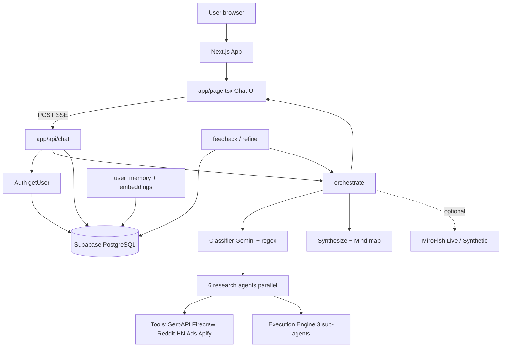

# Veracity AI / Internship Interview Preparation — Growth Intelligence Assistant

This guide prepares you to discuss the **Growth Intelligence Assistant** in a technical interview (Veracity AI, Hatch, or similar AI-native roles). It focuses on project architecture, multi-agent systems, technology choices, design patterns, authentication, databases, APIs, streaming, testing, challenges, and improvements.

It intentionally does not cover leetcode or algorithm puzzles.

**Read alongside:** [README.md](README.md) (product overview) and [ARCHITECTURE.md](ARCHITECTURE.md) (deep technical map).

---

## 1. The Most Important Rule

Do not memorize definitions only. Use this structure when answering:

1. Explain the concept simply.
2. Identify where it appears in Growth Intelligence Assistant.
3. Explain why it was useful.
4. Mention one limitation or improvement.

For example:

> Graceful degradation means the system continues with partial results when one dependency fails. In our orchestrator, Stage-1 agents run under `Promise.allSettled`, so a failed pricing agent does not cancel trends or competitive. Tool results also carry `ok` / `degraded` / `failed` status, and agents apply a signal-quality penalty so confidence cannot stay “high” when sources mostly failed. This keeps demos stable when Reddit blocks or Firecrawl is down, but we still need stronger observability for which tool degraded in production.

That answer is stronger than only defining “fault tolerance.”

---

## 2. Short Project Introduction

### 30-second version

> Growth Intelligence Assistant is a multi-agent growth platform built for the Veracity AI × Hatch hackathon. It is a Next.js and TypeScript app where a user asks a market question in one chat. An orchestrator classifies intent, fans out up to six specialist research agents in parallel against live APIs like SerpAPI, Firecrawl, Reddit, and Hacker News, then optionally runs three execution sub-agents to produce campaign briefs, A/B variants, and outreach. Findings render as inline UI artifacts with sources and confidence scores. We persist sessions, user memory, and embeddings in Supabase PostgreSQL with pgvector, and close the loop with a feedback and refine path.

### 60–90-second version

> Growth teams usually research in one tool, write copy in another, and lose context before they ship. We built a single conversational workspace that closes that loop: live research, content generation, A/B outreach, and refinement from real outcomes.
>
> The app is a Next.js 15 App Router monolith with React 19 on the frontend and business logic in TypeScript under `lib/agents` and `lib/tools`. Google Gemini powers classification, per-agent synthesis, and the final answer. Supabase provides Auth, PostgreSQL, Row Level Security, and pgvector for semantic recall inside a session.
>
> Architecturally it is a two-stage multi-agent system. Stage 1 always runs specialist domains in parallel: market trends, competitive landscape, win/loss, pricing, positioning, and adjacent threats. Stage 2 runs only when the query has execution intent—for example “write a cold email”—and fans out content, A/B, and outreach agents grounded in Stage-1 findings. The UI streams agent status over Server-Sent Events and renders charts, matrices, scorecards, and execution plans inline—not as pasted text.
>
> Optional MiroFish forecast agents and tools like Apify Twitter signals sit on top of the same pipeline. The important design choices are live-signal grounding, structured agent outputs, conversational plus persistent memory, and a refine loop that re-runs full orchestration with feedback injected.

### If they ask for your contribution

Answer only with work you personally completed. A safe structure is:

> My main contribution was **[agents / tools & APIs / orchestrator / UI artifacts / memory / refine]**. I worked on **[specific files]**, solved **[specific problem, e.g. Crunchbase free tier removal → SerpAPI + scrape fallbacks]**, and coordinated with the team through Git and shared types in `lib/agents/types.ts`. I can also explain the full architecture because the chat API, orchestrator, tools, and frontend stream are tightly connected.

Do not claim you personally built every agent, MiroFish, Steal Strategy, and the entire UI if that was team work.

---

## 3. Is This a Monolith or Microservices Architecture?

### Best direct answer

> It is a **modular monolith**: one Next.js deployment unit that contains UI, API routes, agent orchestration, and tool clients. Optional pieces like the MiroFish Python Flask sidecar are **side services**, not a full microservices product architecture.

### Why it is a modular monolith

- One Next.js process serves React pages and API routes.
- Agents and tools are TypeScript modules imported by the orchestrator, not independently deployed services.
- They share one Supabase project (Auth + PostgreSQL).
- A normal release ships UI + API + agent code together.
- Modules are separated by folder (`lib/agents`, `lib/tools`, `app/api`) for clarity—not by network boundaries.

### Why MiroFish is not “microservices”

The optional `mirofish-service` can run as a separate Python process and talk over HTTP, which is a **specialized sidecar**. The core product does not split auth, research, execution, and feedback into independently scaled services with separate databases.

### Do not say

> We used a full microservices architecture.

### Say

> We used a modular Next.js monolith with clear internal module boundaries, and optional external AI sidecars for swarm forecasting.

### Architecture diagram



### Component responsibilities

#### React chat client (`app/page.tsx`)

- Owns conversation state and history sent on every chat request.
- Renders live agent status from SSE `agent_update` chunks.
- Renders artifacts via `ArtifactRenderer`.
- Triggers feedback, refine, Steal Strategy, and usage panels.

#### API routes (`app/api/*`)

- Thin HTTP boundary: auth gate, parse body, call libraries, stream or return JSON.
- Expensive work lives in `lib/`, not inside giant route files.

#### Orchestrator (`lib/agents/orchestrator.ts`)

- Classifies query.
- Fans out agents.
- Optionally runs execution.
- Synthesizes answer and mind map.
- Emits metrics and agent lifecycle callbacks.

#### Domain agents (`lib/agents/*.ts`)

- Call tools in parallel.
- Ask Gemini for typed JSON for their domain.
- Separate `facts` from `interpretation`.
- Attach sources and confidence.

#### Tools (`lib/tools/*`)

- Live HTTP integrations.
- Uniform `ToolResult` with status and confidence.
- Fallbacks and source validation.

#### Supabase

- Auth and cookie sessions.
- Persistence for chats, memory, embeddings, feedback.
- RLS so users only see their own rows.

---

## 4. Important End-to-End Flows

### Standard intelligence query (research)

1. User signs in (Supabase Auth).
2. User types a question; React may attach images and memory context.
3. `POST /api/chat` checks `auth.getUser()`; unauthenticated → 401.
4. Route opens an SSE stream.
5. `orchestrate()` classifies product, domains, and `runExecution`.
6. Up to six research agents run under `Promise.allSettled`.
7. Each agent: plan queries → call tools → Gemini JSON → `AgentOutput`.
8. Orchestrator synthesizes prose + recommendations and builds a mind map in parallel.
9. Route writes `result` with `OrchestratorOutput`.
10. UI renders summary, recommendations, and domain artifacts inline.
11. In the background, memory extraction may update `user_memory`; embeddings may index the turn.

### Execution query (research → action)

1. Same as above through Stage 1.
2. Classifier or regex detects execution intent (“write”, “draft”, “A/B variants”, “campaign brief”).
3. Execution Engine receives `researchOutputs`.
4. Content Agent and A/B Variant Agent run in parallel.
5. Outreach Formatter runs using the variants.
6. `enforceExecutionGrounding` keeps variants tied to research signals.
7. UI shows an `ExecutionPlan` with variants, channels, and deployment steps.

### Feedback → refine loop

1. User rates recommendations or records variant results (reply rate, hypothesis confirmed).
2. Data lands in `recommendation_feedback`, `recommendation_actions`, or `variant_results`.
3. User clicks **Refine with feedback**.
4. `POST /api/refine` builds a feedback summary and injects it into orchestration.
5. Full orchestration re-runs with `forceExecution: true` (not copy-only generation).
6. UI shows updated plan plus refinement deltas.

This is the “closed loop” story judges and interviewers care about.

### Steal Strategy (separate path)

1. Header tab opens `StealStrategyPanel`.
2. `POST /api/steal-strategy` calls Gemini with a structured playbook prompt.
3. Returns historical moves + modern entrant strategy.
4. **Not** the six-agent fan-out—mention this honestly if asked.

---

## 5. Why We Chose Each Technology

### Next.js 15 (App Router) + React 19

Ready-to-say answer:

> We needed one product surface—the conversation—and streaming APIs next to the UI. Next.js App Router lets us colocate React pages and Node API routes, which kept the hackathon loop fast without a separate Express server.

Advantages:

- Single deployable app
- Server routes with long `maxDuration` for agent runs
- Strong TypeScript story with React 19

Tradeoffs:

- Agent work runs in serverless/Node route constraints (timeouts, cold starts).
- Heavy CPU work still belongs outside the request path long-term.

### TypeScript

> Shared contracts in `lib/agents/types.ts` keep orchestrator, agents, and UI aligned on `AgentOutput`, artifact types, and confidence. Structured outputs are much safer when the shape is typed.

### Google Gemini

> Gemini Flash gives fast, cheap multimodal calls for classification, per-agent synthesis, vision on screenshots, and embeddings. One provider simplified keys and cost tracking for a hackathon.

Tradeoff:

> Quality and rate limits depend on one vendor. Production would add evals, caching, and possibly model routing.

### Supabase (Auth + PostgreSQL + pgvector)

> Auth, SQL storage, RLS, and vector search in one managed platform. Cookie-based SSR clients fit Next.js middleware. pgvector supports semantic recall of earlier turns in a session.

Tradeoff:

> Application-level referential integrity still needs care; large JSON `metadata` blobs trade queryability for convenience.

### SerpAPI / Firecrawl / Reddit / HN

> Live signal was a hard constraint—no training-data-only answers. SerpAPI covers search, news, and trends. Firecrawl turns pages into LLM-ready markdown. Reddit public JSON and HN Algolia give buyer and founder sentiment without heavy OAuth for the demo path.

### Tailwind + Recharts + SSE

> Design-system tokens for a polished single-page UI; Recharts for trend artifacts; SSE so judges can *see* agents complete in parallel.

### Vitest

> Fast unit tests around intent detection, grounding, fallbacks, refine helpers, and empty artifacts—areas that break silently if untested.

---

## 6. Multi-Agent Architecture (Core Interview Topic)

### What “multi-agent” means here

> Not one giant prompt. Distinct specialist agents share context, run as separate async units, return typed outputs, and are merged by an orchestrator.

### Stage 1 — Research (always)

| Agent ID | Focus | Artifact |
|----------|--------|----------|
| `market-trends` | Category direction, leading indicators | Trend chart |
| `competitive` | Features, hiring, recent moves | Competitive matrix |
| `win-loss` | Buyer reasons to switch | Win/loss scorecard |
| `pricing` | Tiers, WTP signals | Pricing table |
| `positioning` | Messaging gaps, ad themes | Positioning gap |
| `adjacent` | Outside-category threats | Threat heatmap |

### Stage 2 — Execution (conditional)

| Sub-agent | Output |
|-----------|--------|
| Content | Campaign brief + angles |
| A/B Variant | Three variants with falsifiable hypotheses |
| Outreach | Email/LinkedIn + deployment timeline |

Full path ≈ **9 agents** plus classifier, synthesizer, and mind-map model calls.

### Classifier

- LLM extracts product, competitor, domains, intent, `runExecution`.
- Regex `detectExecutionIntent` is OR’d so obvious “Draft a cold email…” never misses Stage 2 if Gemini misclassifies.
- Always activates at least three domains; vague queries can activate all six.

### Parallelism and failure

> Agents use `Promise.allSettled`. One failure becomes `status: failed` in `agentRuns`; others continue; synthesis uses whatever outputs exist.

### Grounding

> Execution variants must cite Stage-1 signals (`groundedSignals`). Facts vs interpretation are separate arrays. Sources are filtered and ranked. Tool health can lower confidence via `computeSignalQualityPenalty`.

### Live signal vs training data

> Agents are prompted to synthesize from tool payloads. Empty tools should yield low confidence / empty artifacts (`EmptyArtifact`), not invented numbers. Be honest: LLMs can still over-interpret sparse snippets; grounding + sources reduce risk but do not eliminate it.

---

## 7. Design Patterns and OOP-Style Ideas

This codebase is TypeScript functional/module-oriented more than classical Java OOP. Still name patterns that are real.

### 7.1 Orchestrator / Coordinator

Problem: Many agents, shared context, ordered stages, streaming status.

Implementation: `orchestrate()` in `lib/agents/orchestrator.ts`.

Interview answer:

> The orchestrator owns the pipeline: classify, fan out research, optionally run execution, synthesize, and report metrics. Agents do not call each other for Stage 1; they receive `AgentContext` and return `AgentOutput`.

### 7.2 Strategy / Plugin agents

Each agent implements the same shape:

```ts
AgentConfig { id, name, description, run(ctx) => Promise<AgentOutput> }
```

The orchestrator dispatches a list of strategies without caring about domain internals. That is Strategy-like / plugin architecture.

### 7.3 Pipeline

```text
Classify → Research (parallel) → Execution (optional) → Synthesize + Mind map
```

Stages have clear inputs and outputs. Execution depends on research outputs (data dependency).

### 7.4 Observer / event streaming (SSE)

`onAgentUpdate` callbacks push lifecycle changes; the chat route observes and writes SSE chunks. The UI is a subscriber to agent progress.

### 7.5 Simple factory helpers

`buildToolResult` centralizes status and confidence anchors. `ArtifactRenderer` switches on `artifactType` to construct the right React view—factory-like UI routing.

### 7.6 Graceful degradation / Circuit-breaker-lite

Not a full circuit breaker library, but:

- Tool fallback chains (Reddit → HN, Firecrawl → Scrape.do → fetch).
- Status tags `ok` / `degraded` / `failed`.
- Confidence penalties.
- `allSettled` at agent level.

### Claims to avoid

Do not invent “we used Factory Method, Abstract Factory, and Visitor” unless you can point to code. Prefer Orchestrator, Strategy, Pipeline, Observer/SSE, and fallback chains.

---

## 8. SOLID — Honest Mapping

### Single Responsibility

- Classifier vs research agents vs execution vs synthesizer vs tools.
- Routes auth/stream; agents gather and structure; tools fetch.

### Open/Closed

- Adding a research agent: new file + register in `ALL_AGENTS` + artifact type + renderer case.
- Still must touch classifier domain list and types—say “supports extension with disciplined registration,” not perfect OCP.

### Liskov / Interface segregation

- Agents share `AgentConfig` / `AgentOutput` contracts.
- Domain-specific fields extend the base output (e.g. `MarketTrendsOutput`).

### Dependency inversion

- Orchestrator depends on `AgentConfig` abstractions, not concrete SerpAPI calls.
- Weakness: agents still import concrete tools directly. Improvement: inject a tool port for easier mocking.

---

## 9. Authentication and Authorization

### Authentication vs authorization

**Authentication:** Who are you? — Supabase email/password or Google OAuth; middleware refreshes cookies; APIs call `getUser()`.

**Authorization:** What can you do? — Row Level Security: users only read/write their sessions, messages, memory, and feedback. Expensive chat is blocked with 401 if not signed in (cost control).

### Flow

1. Unauthenticated user hits `/` → middleware redirects to `/auth`.
2. Login or OAuth callback exchanges code for session cookies.
3. Browser calls APIs with cookies; server Supabase client reads the session.
4. RLS policies enforce `auth.uid() = user_id` (or ownership through `chat_sessions`).

### Strengths

- Managed Auth (less custom JWT crypto).
- Cookie SSR pattern fits Next.js.
- Chat gated before streaming starts.
- RLS on user data tables.

### Improvements to discuss honestly

1. Rate-limit chat and refine per user.
2. Stricter CORS and security headers.
3. Audit logs for orchestration spend.
4. Review `signal_cache` openness (shared non-PII cache—confirm no leakage).
5. Short-lived sessions and anomaly detection for API key abuse on the server.

There is **no custom bcrypt/JWT stack** like a from-scratch Express app—do not claim you implemented password hashing yourself unless you did elsewhere.

---

## 10. Database Design

### Stack

PostgreSQL on Supabase + pgvector extension.

### Main tables

| Table | Purpose |
|-------|---------|
| `chat_sessions` | Named conversations per user |
| `chat_messages` | Turns; `metadata` jsonb often stores full `OrchestratorOutput` |
| `user_memory` | One row per user: company, products, competitors, facts |
| `chat_embeddings` | 768-dim vectors for session recall |
| `recommendation_feedback` | Thumbs on recommendations |
| `recommendation_actions` | Accepted / rejected / copied |
| `variant_results` | Campaign metrics for refine |
| `signal_cache` | Cached tool payloads by key |

### Normalized vs denormalized

**Normalized:** sessions → messages; feedback references sessions/messages; embeddings FK to session/message.

**Denormalized:** entire orchestration blob in message `metadata` (fast reload of artifacts); arrays/json on `user_memory`; cached tool JSON.

Interview answer:

> We normalize ownership and feedback relations, but denormalize the orchestrator payload into message metadata so reopening a chat can rehydrate charts without recomputing agents. That is an access-pattern choice. The cost is larger rows and weaker ad-hoc SQL over nested findings.

### pgvector

> After turns, we embed text and store vectors. Recall searches within the **same session** so Product A’s chat does not bleed into Product B. Cross-session personalization uses structured `user_memory`, not global vector mix.

### Transactions / consistency

> Feedback writes are usually single-table inserts. Refine reads many rows then re-orchestrates. A production improvement would be idempotency keys on refine and clearer transactional boundaries when recording multiple outcome types together.

### SQL vs “vector DB product”

> We used Postgres + pgvector instead of a separate vector database to keep ops simple. If recall volume and QPS grew, we might evaluate a dedicated vector store—but for session-scoped chat history, Postgres is enough.

---

## 11. REST, SSE, and HTTP

### Styles used

- JSON REST for feedback, memory, refine, steal-strategy, usage-info.
- **SSE** for chat: long-lived stream of typed events.
- Multipart/base64 images inside chat JSON for multimodal Gemini.

### Chat SSE chunk types

- `orchestration_log` — human-readable progress line
- `agent_update` — agent lifecycle + live metrics
- `result` — final `OrchestratorOutput`
- `mirofish_result` / `mirofish_live_result` — optional later chunks
- `error` — failure message

### Why SSE instead of one JSON response

> Judges and users need to see parallel agents finish. Waiting for a single 30–90s JSON body feels like a dead spinner. SSE updates status progressively; the authoritative answer still arrives as one `result` payload.

### Status codes you may cite

- `401` — not authenticated on chat
- `400` — invalid body / missing query
- `200` + event stream — chat
- Tool/agent failures usually surface **inside** the stream or as failed agent runs, not always as HTTP 500

### `maxDuration = 120`

> Agent fan-out exceeds default serverless limits. Chat and refine request up to 120 seconds. Hobby plans may still wall-clock lower—mention as a deployment constraint.

---

## 12. Memory (Three Layers)

| Layer | Where | Lifetime | Purpose |
|-------|--------|----------|---------|
| Conversation history | React state + `chat_messages` | Session | Follow-ups and classifier context |
| Persistent memory | `user_memory` | Cross-session | Company, products, competitors, facts |
| Semantic recall | `chat_embeddings` | Session-scoped | “What did we conclude earlier about pricing?” |

Ready-to-say answer:

> Short-term memory is the message history sent with every `/api/chat` call. Long-term structured memory is extracted asynchronously into `user_memory` and injected as `memoryContext`. Semantic recall uses embeddings inside the session. We deliberately avoid cross-session vector bleed.

---

## 13. Testing

```bash
npm test
```

Suites under `__tests__/`:

| Suite | What it protects |
|-------|------------------|
| `execution-intent` | Regex fires on generation queries, silent on pure research |
| `grounding-contract` | Execution stays tied to research signals |
| `tool-fallback` | Status/confidence penalties and settled-result extraction |
| `refine-loop` | Feedback summary / delta helpers |
| `memory-context` | Memory string / POST contract |
| `query-planner` | Multi-hop query bundles |
| `empty-artifacts` | UI does not crash on empty agent arrays |
| `ui-execution-paths` | Execution UI paths |

### Honest limitation

> These are focused unit/contract tests. We do not yet have full E2E Playwright coverage of live SerpAPI + Gemini runs (costly and flaky). Domain logic that fails without network is prioritized.

---

## 14. Challenges and Strong Interview Answers

### Challenge 1: “Not a chatbot” requirement

> Plain text answers fail the brief. We defined artifact types per domain and rendered purpose-built React components inside the thread. Empty results show `EmptyArtifact` instead of inventing charts.

### Challenge 2: Live signal only

> Every research agent performs multiple tool calls. Sources attach URLs and tool names. When Crunchbase free access went away, we pivoted to SerpAPI site queries plus scrape enrichment and graceful degradation so demos still ran.

### Challenge 3: Parallelism without total failure

> `Promise.allSettled` plus per-agent status in the UI. Partial intelligence is still useful.

### Challenge 4: Execution must not hallucinate angles

> Stage-2 agents receive Stage-1 outputs; grounding enforcement and falsifiable hypotheses force variants to point at research signals.

### Challenge 5: Intent detection

> Pure LLM classification misses obvious imperatives. We OR a deterministic regex with the classifier so “Write a cold email…” always opens Stage 2.

### Challenge 6: Cost and latency visibility

> Live and final metrics estimate Gemini call cost and wall-clock time so we can argue scalability and stay near hackathon cost targets.

### Challenge 7: Conversational memory without “as I said earlier”

> History and `user_memory` are injected silently. Agents should not re-ask the product name every turn.

---

## 15. Honest Weaknesses and Improvements

### Architecture

- Keep the monolith until a domain needs independent scale (e.g. dedicated scrape workers).
- Extract a job queue for agent runs so HTTP requests do not own 120s of work.

### Reliability

- Add retries with backoff and circuit breakers for SerpAPI/Firecrawl.
- Structured logs + correlation IDs per orchestration.
- Distinguish “process up” from “tools healthy.”

### Quality

- Offline eval suite with golden queries and source-coverage metrics.
- Stricter schema validation (e.g. Zod) on every agent JSON parse.
- Human-in-the-loop for high-stakes recommendations.

### Security

- Per-user rate limits and spend caps.
- Redact secrets from tool caches.
- Review what lands in message metadata.

### Product

- Clearer channel clarification UI inside the thread.
- Stronger generalization demos beyond Vector Agents.
- Replace heuristic cost estimates with provider usage APIs where possible.

---

## 16. Likely Interview Questions and Model Answers

### “Explain your architecture.”

> Browser loads a Next.js React chat UI. Authenticated `POST /api/chat` streams SSE. The orchestrator classifies the query, runs six research agents in parallel against live tools, optionally runs three execution sub-agents, then synthesizes an answer and mind map. Results and agent status stream to the UI as inline artifacts. Supabase stores auth, chats, memory, embeddings, and feedback. Refine re-runs orchestration with outcomes injected.

### “Why multi-agent instead of one prompt?”

> Different domains need different tools and schemas. Parallel specialists reduce latency versus sequential mega-prompts and produce typed artifacts per domain. The orchestrator merges them with explicit confidence and sources.

### “How do you prevent hallucination?”

> Tool-first retrieval, facts vs interpretation separation, source URLs, confidence labels, grounding for execution, empty-artifact UI, and confidence penalties when tools degrade. Residual risk remains when snippets are thin—so we prioritize transparency over fake certainty.

### “Is this LangChain / LangGraph?”

> Core orchestration is custom TypeScript with `Promise.allSettled` and shared types. We did not require LangGraph for the hackathon path. Optional MiroFish/swarm pieces sit beside the main orchestrator. Be accurate about what you actually used.

### “Monolith or microservices?”

> Modular monolith Next.js app; optional MiroFish sidecar. Not independently deployed auth/research/execution microservices.

### “How does streaming work?”

> The chat route writes SSE events as agents transition pending → running → completed/failed, then sends a final `result` object. The client updates pills and finally hydrates artifacts.

### “How is memory implemented?”

> Three layers: chat history, persistent `user_memory`, session pgvector recall. See section 12.

### “What happens if Reddit is blocked?”

> Reddit tool falls back to HN Algolia and marks the result `degraded`, which can lower agent confidence.

### “How does refine differ from just regenerating copy?”

> Refine reloads recorded outcomes, injects a feedback summary into context, and re-runs **full** orchestration with execution forced—so research conclusions can change, not only subject lines.

### “What did you test?”

> Intent detection, grounding contract, tool fallback math, refine helpers, memory context shape, empty artifact safety. Not full live E2E of every API.

### “What would you improve first in production?”

> Queue-based agent workers, rate limits/spend caps, stronger evals, structured observability, and transactional/idempotent refine.

### “How does this relate to Vector Agents?”

> Vector Agents was the **demo product**, not the codebase we forked. The system classifies any product from query + memory. Generalization is a required talking point.

### “What is Steal Strategy?”

> A separate Gemini playbook endpoint/UI tab for competitive move analysis. It is not the six-agent research fan-out—don’t conflate them.

---

## 17. Questions You Can Ask the Interviewer

- How does Veracity decide between custom agent orchestration and frameworks like LangGraph?
- How do you evaluate grounding and hallucination in production agent systems?
- What does “AI-native” development look like day to day for interns (Claude, code review, ownership)?
- How do you handle cost controls and timeouts for long multi-tool agent runs?
- What would make an intern successful in the first month on VectorAgents?

---

## 18. Files to Review Before the Interview

### Architecture and chat

- `README.md`
- `ARCHITECTURE.md`
- `app/page.tsx`
- `app/api/chat/route.ts`
- `lib/agents/orchestrator.ts`
- `lib/agents/types.ts`

### Agents and execution

- `lib/agents/market-trends.ts` (representative research agent)
- `lib/agents/execution/execution-engine.ts`
- `lib/agents/execution/grounding.ts`
- `lib/agents/execution-intent.ts`

### Tools and resilience

- `lib/tools/fallback.ts`
- `lib/tools/reddit.ts`
- `lib/tools/firecrawl.ts`
- `lib/tools/serpapi.ts`

### Auth and data

- `middleware.ts`
- `app/auth/page.tsx`
- `supabase/migrations/001_chat_sessions.sql`
- `supabase/migrations/002_chat_embeddings.sql`
- `supabase/migrations/003_feedback_loop.sql`
- `lib/memory.ts`

### Feedback loop and UI

- `app/api/refine/route.ts`
- `app/api/feedback/route.ts`
- `components/artifacts/ArtifactRenderer.tsx`
- `components/artifacts/ExecutionPlan.tsx`

### Tests

- `__tests__/execution-intent.test.ts`
- `__tests__/grounding-contract.test.ts`
- `__tests__/tool-fallback.test.ts`
- `__tests__/refine-loop.test.ts`

---

## 19. Claims to Avoid

Avoid:

> It is a complete microservices architecture.

Use:

> Modular Next.js monolith with optional AI sidecars.

Avoid:

> Every answer is 100% hallucination-proof.

Use:

> We constrain hallucination with live tools, sources, confidence, and grounding; residual risk remains.

Avoid:

> I alone built the entire platform.

Use:

> Team hackathon; my ownership was **[X]**; I understand the full system interfaces.

Avoid:

> We used LangChain for everything.

Use:

> Custom TypeScript orchestration; cite frameworks only if you actually used them.

Avoid:

> Steal Strategy is our six-agent orchestrator.

Use:

> Separate Gemini playbook feature alongside the main multi-agent chat.

Avoid:

> pgvector memory is global across all users’ chats.

Use:

> Embeddings recall is session-scoped; cross-session context uses structured `user_memory`.

---

## 20. Final Revision Checklist

Before the interview, be able to explain without notes:

- [ ] Project in 30 seconds and 90 seconds
- [ ] Your exact personal contribution
- [ ] Why modular monolith, not microservices
- [ ] Two-stage agent pipeline (6 + 3)
- [ ] Classifier + regex execution intent
- [ ] Why `Promise.allSettled`
- [ ] Live tools and one fallback chain
- [ ] Facts vs interpretation, sources, confidence
- [ ] SSE streaming model
- [ ] Three memory layers
- [ ] Feedback → refine closed loop
- [ ] Supabase Auth + RLS at a high level
- [ ] Why message metadata is denormalized
- [ ] What Vitest covers—and what it does not
- [ ] One challenge you solved
- [ ] Three production improvements
- [ ] How the system generalizes beyond Vector Agents

Final answering structure:

> **Concept → Project example → Why we used it → Limitation or improvement**

That structure demonstrates understanding rather than memorization.
